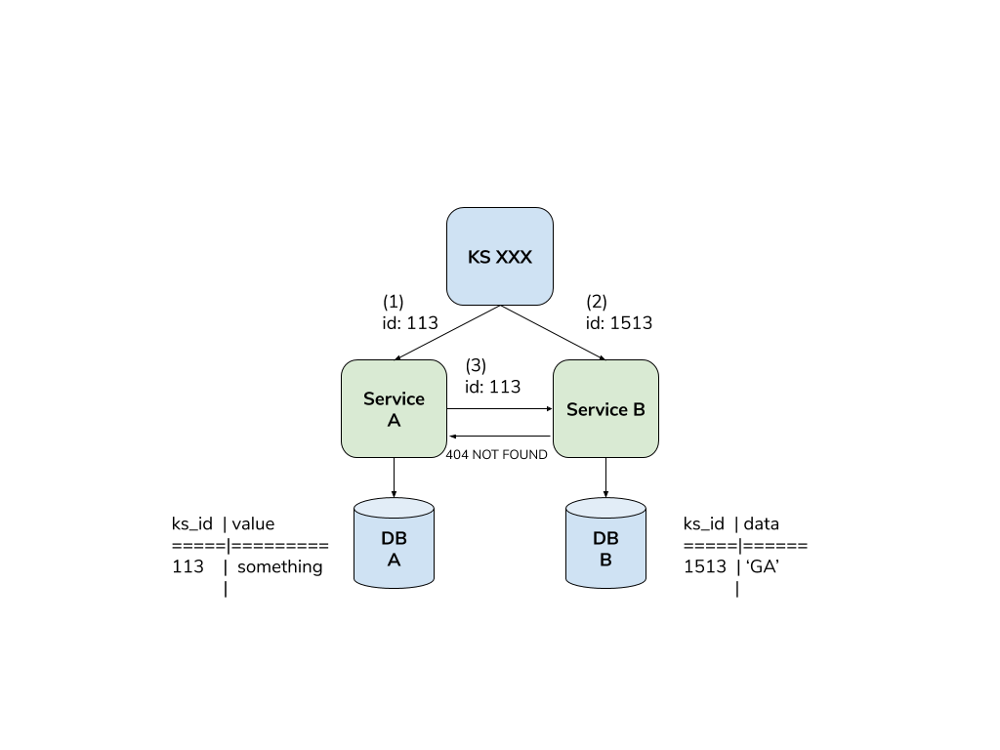
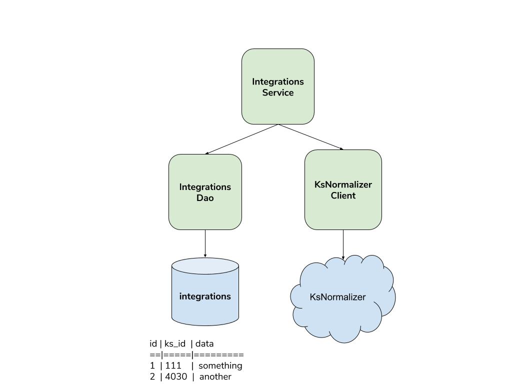

# KsNormalizer
Developer interview home assignment (estimated: 1-2 hours).
 
This specific implementation uses java 11, gradle & guice, but it can be implemented using any language. The important thing is to implement & test!

## Setup
In intellij: open... -> choose `build.gradle` file

Solution is in `ksnormalizer-solution` branch.

## Background
Kenshoo applications are based on 2 types of services:
1. A single-tenant - serving each customer (aka Kenshoo Server or KS in short)
2. Multi-tenant services - many different microservices serving all the customers

Each KS has a numeric identifier, composed of 3-4 digits (eg. 113, 4004). A KS might have multiple identifiers according to a well-defined logic. For example, 113 is also identified by 1513 and 4013.

## Problem Statement

As mentioned, a KS might have multiple identifiers. This can be an issue when a multi-tenant service stores data for a specific KS. By which id should it be stored? And what will happen when 2 different (multi-tenant) services will communicate between each other.
Let’s look at the following example:
1. KS passes id=113 to service A, which stores it in its db, together with relevant data.
2. KS passes id=1513 to service B, which stores it in its own db, together with other relevant data. You may ask, why does it pass a different id? Well, bugs happen…
3. Service A tries to fetch data from service B by passing id=113. However, service B is not familiar with this id and will return 404 NOT FOUND http response.



## Required Solution
We'll be focusing on a service of our own called `Integrations`. It has its own db with one table called... `integrations`! It looks like this:

| id | ks_id  | data      |
|----|--------|-----------|
|1   | 111    |  something|
|2   | 4030   |  another  |
  
As you can see the service uses a ks id and you need to assure it's the correct one!

Luckily, there's already a `KsNormalizerClient` class which wraps calls to external microservice which returns the normalized ks id for a provided one. It looks like this:
```java
public interface KsNormalizerClient {
    String normalize(String ksId) throws IOException;
}
```

There's also `IntegrationsDao` which serves as the `integrations` table data access class. It looks like this:
```java
public interface IntegrationsDao {
    /**
     * @return number of affected rows (0 or 1)
     */
    int insert(String ksId, String data);

    /**
     * @return number of affected rows (0 or 1)
     */
    int update(int id, String ksId, String data);

    /**
     * @return number of affected rows
     */
    int updateKsId(String oldKsId, String newKsId);

    List<Integration> fetchById(int id);
    List<Integration> fetchByKsId(String normalizeKsId);
    List<Integration> fetchAll();
}
```

`Integration` is a simple POJO representing a row in the `integrations` table.

**Your task** is to implement and test the `IntegrationsService` class according to the following interface:
```java
public interface IntegrationsService {
    /**
     * Inserts data into the integrations table
     *
     * @param ksId a ks id, might be not normalized
     * @param data
     */
    void insertIntegration(String ksId, String data);

    /**
     * Returns all integrations having the provided ks id
     *
     * @param ksId a ks id, might be not normalized
     * @return list of all the integrations having the provided ks id
     */
    List<Integration> fetchIntegrationsByKsId(String ksId);

    /**
     * Updates all rows in integrations table with normalized ks id
     *
     * @return number of affected rows
     */
    int migrate();
}
``` 

